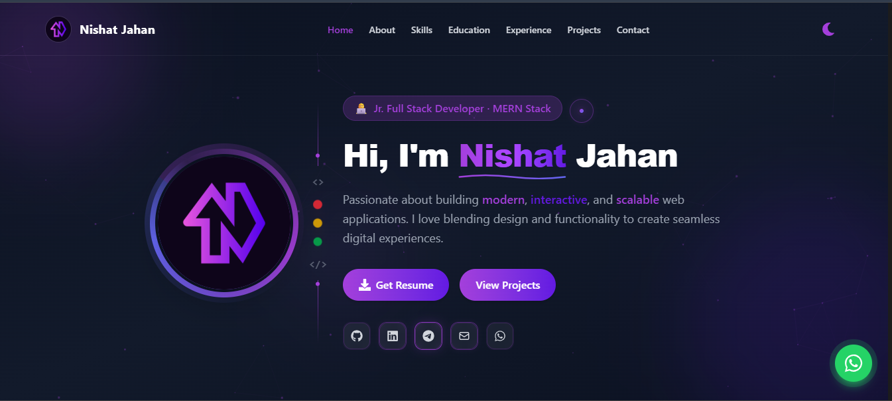

# 🌐 Nishat Jahan — Portfolio Website

  

A modern, responsive, and professional **portfolio website** built to showcase my skills, experience, and projects as a **Junior Full-Stack Web Developer (MERN)**.  
This portfolio highlights my journey, technical expertise, and featured projects with a clean UI, smooth animations, and interactive design.

---

## 👩‍💻 About Me
Section describing my background, journey, interests, and what I enjoy doing.

---

## 🛠️ Tech Stack
Section showcasing the technologies and tools I work with, categorized for clarity.

---

## 🚀 Featured Projects
Section highlighting my best projects with visuals and links.

---

## 📞 Contact
Section providing ways to reach me — email, social links, and messaging platforms.

---

## 🛠️ Tech Stack

**Frontend:** HTML · CSS · JavaScript · React  · Tailwind CSS  
**Backend:** Node.js · Express.js ·   

--- 

✨ Crafted with passion and code by Nishat Jahan ✨

